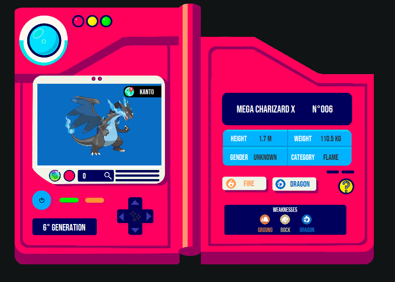

# Pokedex-JavaFX

Pokedex desenvolvida em Java, utilizando JavaFX. A aplicação permite visualizar informações sobre diferentes Pokémon, como seus tipos, fraquezas, categoria, versões alternativas e muito mais.
## Aprendizados

- O básico de Interfaces gráficas com JavaFX, criação de gerenciamento de scenes e stages, além de customização com CSS.
## Bibliotecas utilizadas

- JavaFX: [https://openjfx.io/](https://openjfx.io/)
- Maven: [https://maven.apache.org/](https://maven.apache.org/)
- Gson: [https://github.com/google/gson](https://github.com/google/gson)
## Screenshots

## Autores

- [@ViictorP](https://www.github.com/ViictorP)

## Licença

